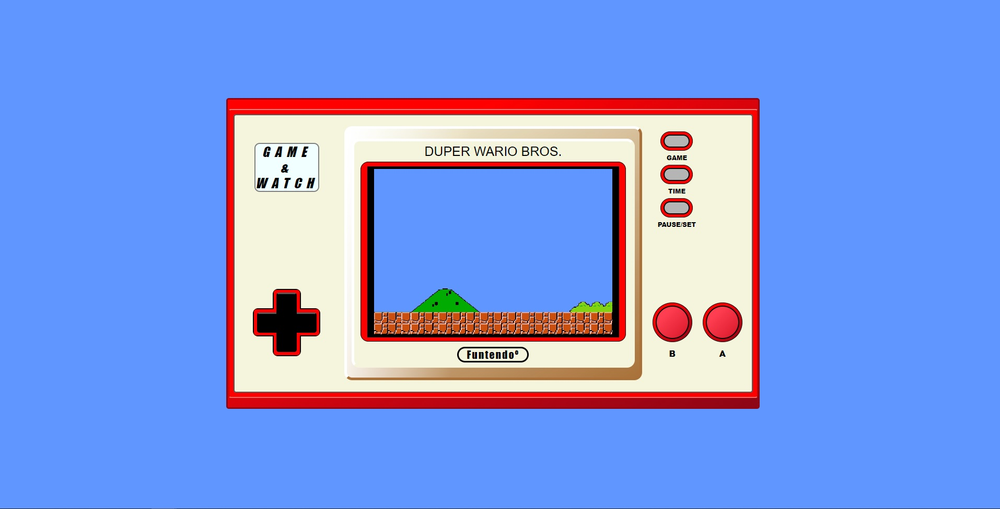

# Bienvenido a mi proyecto

<details>
  <summary>Contenido 📝</summary>
  <ol>
    <li><a href="#objetivo-🎯">Objetivo</a></li>
    <li><a href="#sobre-el-proyecto-🔎">Sobre el proyecto</a></li>
    <li><a href="#stack">Stack</a></li>
    <li><a href="#instalación-en-local">Instalación</a></li>
    <li><a href="#vistas">Vistas</a></li>
    <li><a href="#futuras-funcionalidades">Futuras funcionalidades</a></li>
    <li><a href="#contribuciones">Contribuciones</a></li>
    <li><a href="#webgrafia">Webgrafia</a></li>
    <li><a href="#contacto">Contacto</a></li>
  </ol>
</details>

## Objetivo 🎯

Este es un proyecto para practicar HTML y CSS, el uso de contenedores y Flexbox.

## Sobre el proyecto 🔎

Decidí replicar la imagen frontal de la consola Game&Watch de Nintendo. Todo esta creado a partir de contenedores y sus propiedades en CSS.

## Stack

<div align="center">
<a href="https://www.reactjs.com/">
    
</a>
 </div>

## Instalación en local

1. Clonar el repositorio
2. `$ npm install`
3. `$ npm run dev`
4. ...

## Vistas

Landing
  
Referencia


## Futuras funcionalidades

<!-- ✅   -->

⬜ Implementar un video en la pantalla  
⬜ Funcionalidades en los botones

## Contribuciones

Las sugerencias y aportaciones son siempre bienvenidas.

Puedes hacerlo de dos maneras:

1. Abriendo una issue
2. Crea un fork del repositorio
   - Crea una nueva rama
     ```
     $ git checkout -b feature/nombreUsuario-mejora
     ```
   - Haz un commit con tus cambios
     ```
     $ git commit -m 'feat: mejora X cosa'
     ```
   - Haz push a la rama
     ```
     $ git push origin feature/nombreUsuario-mejora
     ```
   - Abre una solicitud de Pull Request

## Webgrafia:

Para conseguir mi objetivo he recopilado información de:

- https://developer.mozilla.org/en-US/
- https://css-tricks.com/snippets/css/a-guide-to-flexbox/
- https://www.w3schools.com/css/default.asp

## Contacto

<a href = "mailto:adrianapardo1998@gmail.com"></a>
<a href="https://www.linkedin.com/in/adriana-pardo-diez/" target="_blank"></a>

</p>
